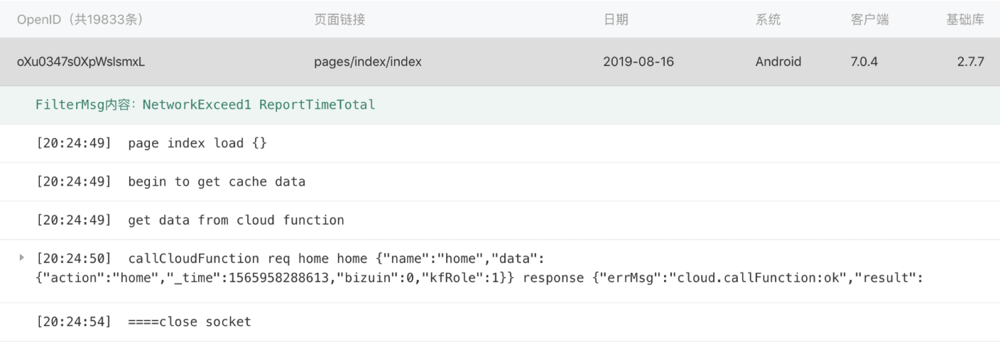
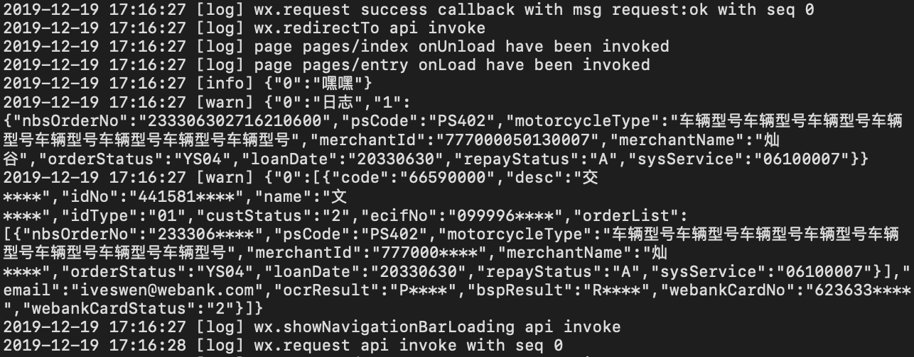

# wxa-log
结合微信的实时日志，在上报微信实时日志的同时

也能在控制台输出console打印信息

如果用户[反馈了相关问题](https://developers.weixin.qq.com/miniprogram/dev/api/base/debug/LogManager.html)，在微信管理台下载的日志，除去原有的调用流程，使用wxa-log上报的日志也会一并出现在日志中

`注意：开发者工具中目前不会上报日志，请用真机操作之后，在管理台-开发-运维中心-实时日志中查看`

## 安装
```
npm install -S @wxa/log
```

## 使用方法
1、wxa目前只能在`页面(page)、组件(component)`中注入全局方法。在项目的`app.js`中使用如下代码全局引用：
```
import logPlugin from '@wxa/log';
wxa.use(logPlugin);

@App
class Main {
    ...
}
```
2、在页面或者组件的具体位置打印日志：
推荐如下格式日志上传：
```
// 该格式日志将会针对文本中身份证、手机号码、邮箱信息进行校验并给开发者提示，但依旧会上传日志
this.$log.info('这是什么日志');
// 该格式日志将会针对第一个参数进行身份证、手机号码、邮箱信息校验并给开发者提示，后续参数中的敏感信息将会做掩码处理，但依旧会上传日志
this.$log.info('页面唤起时间: ', data);
this.$log.warn('warn');
this.$log.error('error');
this.$log.setFilterMsg('filterkeyword');
this.$log.setFilterMsg('addfilterkeyword');
```
注意：使用前请仔细阅读[官方文档](https://developers.weixin.qq.com/miniprogram/dev/framework/realtimelog/)，实时日志上报适用于关键流程，一条日志的上限是5KB，避免在循环里面调用打日志接口，所以仅需要改造现有项目关键流程日志上报逻辑即可

## 在js文件中上报实时日志
1、在文件顶部引入插件：
```
import {$log} from '@wxa/log';
```
2、在文件具体位置打印日志：
```
// 该格式日志将会针对文本中身份证、手机号码、邮箱信息进行校验并给开发者提示，但依旧会上传日志
$log.info('这是什么日志');
// 该格式日志将会针对第一个参数进行身份证、手机号码、邮箱信息校验并给开发者提示，后续参数中的敏感信息将会做掩码处理，但依旧会上传日志
$log.info('页面唤起时间: ', data);
$log.error('error');
$log.setFilterMsg('filterkeyword');
$log.setFilterMsg('addfilterkeyword');
```
